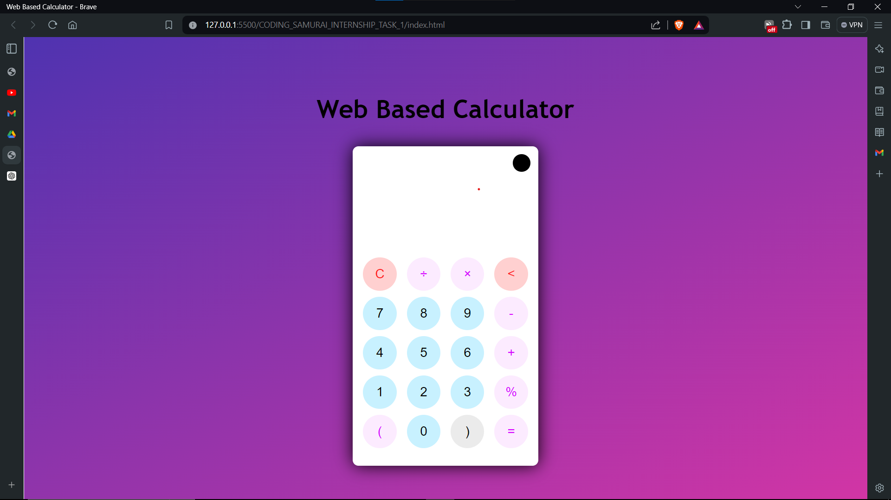
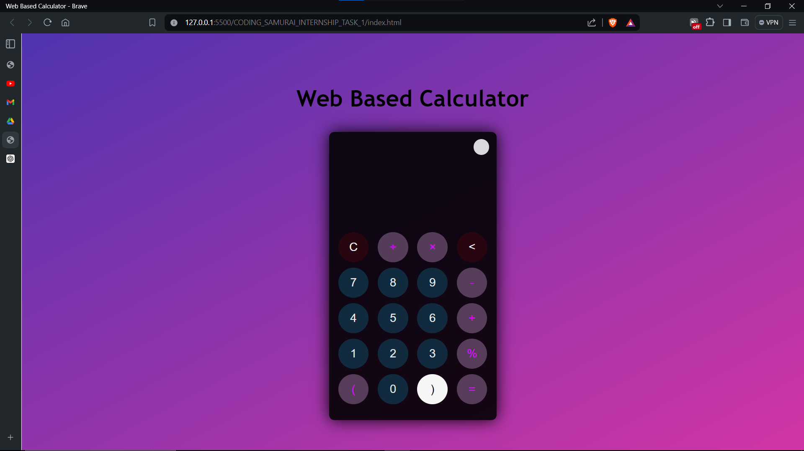

# CODING_SAMURAI_INTERNSHIP_TASK_1
# Web-based Calculator

## Project Description
This project is a simple yet functional web-based calculator that allows users to perform basic arithmetic operations. It is designed to be user-friendly and responsive, making it accessible on various devices including desktops, tablets, and smartphones.

## Features
- Basic Arithmetic Operations:  Addition, Subtraction, Multiplication, Division.
- User Interface:  Clean and intuitive interface with buttons for numbers, operators, and essential keys (equals, clear).
- Input Handling:  Users can input numbers and operators by clicking the buttons on the UI. The input expression and result are displayed on the screen.
- Error Handling:  Manages scenarios such as division by zero and invalid inputs.
- Responsive Design:  Works well on different screen sizes.
- Clear Functionality:  A clear button to reset the input and start a new calculation.
- User-Friendly Styling:  Basic styling using CSS to make the calculator visually appealing and easy to use.
- Dark Mode:  Toggle between light and dark modes.

## Screenshots
### Light Mode

### Dark Mode

## How to Use
1. Clone or download the project files.
2. Open the `index.html` file in a web browser.
3. Use the buttons to input numbers and operators.
4. Click the equals button to see the result.
5. Use the clear button to reset the calculator.

## Technologies Used
- HTML
- CSS
- JavaScript

## Author
Aryan (@aryannxroot)

## License
This project is licensed under the MIT License.

## Working 
(images/p1.png)
(images/p2.png)
(images/p3.png)
(images/p4.png)